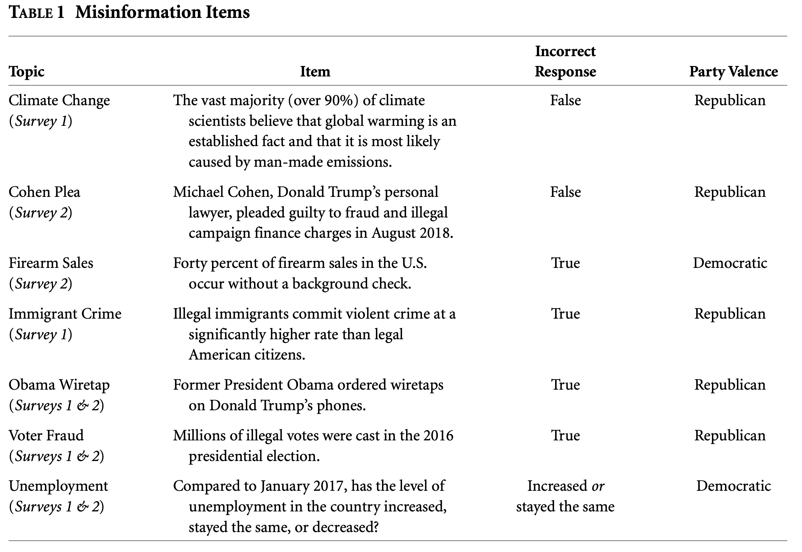

```{r setup, include=FALSE}
knitr::opts_chunk$set(echo = TRUE)
library(tidyverse)
library(dplyr)
library(tidyr)
library(ggplot2)
library(lmtest)
library(sandwich)
library(estimatr)
library(stargazer)
library(effsize)

```

This week, to follow on from my media polarisation analysis from last weeks data, we looked in more detail at patterns of media consumption and how it effects political attitudes. The data comes from Peterson and Iyengar's 2020 paper: "Partisan Gaps in Political Information and Information-Seeking Behavior: Motivated Reasoning or Cheerleading?" and contains respondents answers to true or false questions based on current events and opinions they hold, and the dependent outcomes where the news source they choose (from a choice spanning left, right, central and expert news sources), and the information they gain from their choice measured by the true/false questions. The random treatment introduced was a small payment each time the respondent gave a correct answer. This allowed them to explore their hypothesis in a couple of ways best described in their own words:

"If cheerleading is the predominant explanation for these differences, providing incentives should markedly weaken the partisan divide, as partisans would be expected to revert to their “true” state of knowledge when responding. On the other hand, if the motivated reasoning hypothesis holds, then misinformation is genuine and incentives should have minimal effects on partisan divides across these items.

Second, we apply the same logic to assess the effect of financial incentives on respondents’ information-seeking behaviour and, specifically, whether the presence of incentives encourages the use of unbiased or nonpartisan news providers (versus co-partisan news sources). Again, if cheerleading is at work, we would expect reliance on partisan sources to be weakened among incentivised respondents, whereas the motivated reasoning account predicts no differences in information preferences across the experimental conditions." (Peterson and Iyengar 2020)

The questions asked were as follows:


```{r, echo=FALSE, out.width = "100%"}

```


```{r}

load("misinfo.combined.RData")

```


To begin with, as per usual, I looked at an overview of the data. This histogram shows how many questions each respondent got right out of the five asked. As cam be seen from the graph below, the general political knowledge of the respondents is pretty good, with the modal number being 4 correct answers out of the five.


```{r}

info <- misinfo.combined %>% 
  group_by(caseid) %>% 
  mutate(total_correct = sum(correct.answer, na.rm = TRUE))
  
ggplot(info, aes(x = total_correct)) +
  geom_histogram(binwidth = 0.5, fill = 'darkred') +
  theme_classic()


```


To quickly explore how the treatment changed the responses I split this result by treatment status and looked at statistical significance. A t-test showed that the result was very statistically significant. However, Cohen's d test suggests that the effect of the treatment was small - this in turn suggests that while the treatment was statistically significant, the actual cause of this significance could be in part down to sampling error or other compounding factors. This being said, when compared to last weeks data and corresponding Cohen's d test of the conditions I was exploring this shows a much larger effect size and the difference is at least of 'small' meaning.


```{r}

ggplot(info, aes(x = total_correct)) +
  geom_histogram(binwidth = 0.5, fill = 'darkred') +
  facet_wrap(~ incentive) +
  theme_classic() +
  labs(title = "By Treatment",
       subtitle = "Treatment Was Incentive to Answer Correctly")

info %>% 
  group_by(incentive) %>% 
  t.test(total_correct ~ incentive, .)

info %>% 
  group_by(incentive) %>% 
  cohen.d(total_correct ~ incentive, .)


```


```{r}

load("combined.survey.demos.dea.RData")

combined <- info %>% 
  left_join(combined.survey.demos, by = "caseid")

```


As the treatment appeared to have relatively little impact on the response, I decided to instead explore any correlation, and potential causation, between demographic variables in the data and the number of questions answered correctly.


```{r}

combined <- combined %>% 
 mutate(race = ifelse(white == 1, 1,
                      ifelse(black == 1, 2,
                             ifelse(hispanic == 1, 3, 
                                    ifelse(other.race == 1, 4, NA)))))


combined %>% 
  group_by(caseid) %>% 
  ggplot(., aes(x = total_correct)) +
    geom_density(adjust = 3, fill = "darkred") +
    facet_wrap( ~ race) +
    theme_classic() +
    labs(title = "By Race",
         subtitle = "1 = White, 2 = Black, 3 = Hispanic, 4 = Other",
         y = "Density",
         x = "Total Correct")

combined1 <- combined %>% 
  mutate_at(17, ~replace(., is.na(.), 2))

combined2 <- combined1 %>% 
  mutate(pid.binary = ifelse(pid.binary == 1, "Democrat", 
                             ifelse(pid.binary == 0, "Republican", 
                                    ifelse(pid.binary == 2, "Independent", NA))))

combined2 %>% 
  group_by(caseid) %>% 
  ggplot(., aes(x = total_correct)) +
    geom_density(adjust = 3.5, fill = "darkred") +
    facet_wrap( ~ pid.binary) +
    theme_classic() +
    labs(title = "By Ideology",
         y = "Density",
         x = "Total Correct")

```

As respondent numbers changed by group I have plotted these visualizations by density so that comparing between them is easier. I chose the two most obvious demographic variables - race and political ideology. When comparing by race, the white and 'other' respondents had a high proportion responding correctly to 4 questions. This is a higher correct response rate to both black and hispanic respondents, who can be seen to have a density curve shifted slightly further left; here black respondents actually had a peak not at four like the other three but at 3 correct responses. The reasons for a difference here may be most easily explained by a lower interest/following of current events, resulting in more incorrect responses. To understand why there is potentially less interest in current political events among black respondents it would be interesting to further explore how income and age compound this difference when compared to other demographics. I think the most simple answer would be a dissatisfaction with politics and thus a lack of interest in following news relating to current political events, but there may be many other reasons.


I wanted to further look at how reported ideology effected the number of correct responses. This is of particular interest as partisan media's reporting of current events has greatly impacted the spread of misinformation and, to be reductive, led to polarization about hugely important political issues and helped determine the recent course of politics. 

```{r}

x <- combined2 %>% 
  filter(incentive == 0) %>% 
  filter(pid.binary == "Democrat") %>% 
  group_by(pid.binary, topic) %>%
  summarize(prop_dem = mean(correct.answer, na.rm = TRUE))

y <- combined2 %>% 
  filter(incentive == 0) %>% 
  filter(pid.binary == "Republican") %>% 
  group_by(pid.binary, topic) %>%
  summarize(prop_rep = mean(correct.answer, na.rm = TRUE))

xy <- x %>% 
  left_join(y, by = "topic") %>% 
  mutate(diff = abs(prop_dem - prop_rep)) %>% 
  arrange(desc(diff)) %>% 
  select(2,3,5,6)

library(gt)

xy %>% 
  gt() %>% 
  tab_header(title = "Partisan Information Divides in Unincentivized Conditions") %>% 
  cols_label(topic = "Topic",
             prop_dem = "Share Correct (Dem)",
             prop_rep = "Share Correct (Rep)",
             diff = "Partisan Divide") %>% 
  fmt_number(., columns = vars("prop_dem", "prop_rep", "diff"), decimals = 2)
  


```


This table shows how people who align with each party differ in correct responses to each of the five questions, and the resulting partisan divide between the two. What is interesting here is that for quite a few questions democrats almost entirely respond correctly but republicans only answer the same questions with mostly only around half being correct. This is more than coincidental and clearly shows a very polarized opinion/beliefs held by many republican respondents, which can then be played on by whoever is looking for their voter support. In the instance where more republicans responded correctly and there was a large partisan divide, still only 56% republicans responded correctly - contrasting with the almost entirely correct responses that democrats had to other questions that generated partisan divide. Without laboring the point here, this clearly shows that either information is reaching those of different ideologies from partisan news sources with different 'filters' on what is important/true, or there are other issues driving polarization and its negative impact on modern politics.


